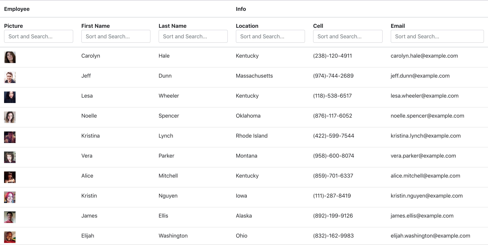

# Employee-Directory-App

An employee directory with React.

The user is able to:

- Sort the table by at least one category
- Filter the users by at least one property.

## User Story

As a user, I want to be able to view my entire employee directory at once so that I have quick access to their information.

## Business Context

An employee or manager would benefit greatly from being able to view information about other employees. It would be particularly helpful to be able to search for employees based on information.

## Instructions

To setup, run npm install.

To run app, run npm start.

Start up page will look similar to this.

# Technologies

Node js
Javascript
APIs
React Js

## Preview
